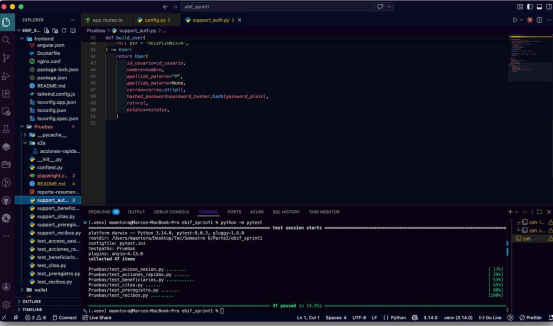
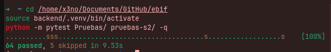

# Informe resumen de pruebas — EBIF

**Desarrollo e implantación de sistemas de software (Gpo. 107)**  
Tecnológico de Monterrey — Campus Monterrey

| Campo | Valor |
|--------|--------|
| ID del proyecto | EBIF-GPO107-2026 |
| Referencia | TSR-EBIF-20260515-02 |
| AUT | EBIF — Sistema de gestión (FastAPI + Angular) |
| Fecha del documento | 15 de mayo de 2026 |
| Versión | Sprint 1 + Sprint 2 (actualización) |

**Equipo:** Emilio Antonio Peralta Montiel (A01712354), Ricardo Bastida Rodríguez (A00839429), Marco Antonio Torres Ramírez (A00839451), Andrés Huerta Robinson (A00838626), Diego Guadiana Manjarrez (A01285889).

---

## Introducción

Este documento resume las **pruebas automatizadas** del sistema EBIF, alineadas con historias de usuario y criterios de aceptación (identificadores **SV-*** en Sprint 1 y **HU-09 … HU-17** en Sprint 2).

Las pruebas se ejecutan con **pytest** desde la raíz del repositorio (`pytest.ini` con `pythonpath = backend .`). La mayoría de los escenarios usan **FastAPI + TestClient** con repositorios en memoria; Sprint 2 añade una prueba opcional de **integración con Oracle** cuando `EBIF_S2_USE_ORACLE=1`.

---

## 1. Alcance

### Sprint 1 — carpeta `Pruebas/`

| Módulo | Historias / refs. |
|--------|-------------------|
| `test_acceso_sesion.py` | SV-1 … SV-6 — login, JWT, rutas protegidas |
| `test_beneficiarios.py` | SV-7 … SV-17 |
| `test_preregistro.py` | SV-24 … SV-30 |
| `test_citas.py` | SV-31 … SV-35, SV-37 |
| `test_acciones_rapidas.py` | SV-38 … SV-43 (contrato Angular; SV-40–42 omitidos E2E) |
| `test_recibos.py` | SV-44 … SV-50 + stats / métodos de pago |

### Sprint 2 — carpeta `pruebas-s2/`

| Módulo | Historia | Contenido |
|--------|----------|-----------|
| `test_hu09_curp.py` | HU-09 | Validación CURP en DTO; duplicado API pendiente (skip) |
| `test_hu10_almacen.py` | HU-10 | Productos, stats, alta encargado, servicios |
| `test_hu11_reportes.py` | HU-11 | Resumen JSON y export PDF |
| `test_hu12_notificaciones.py` | HU-12 | Lista agregada; alertas almacén y citas hoy |
| `test_hu13_usuarios.py` | HU-13 | Listado/creación usuarios; config pública |
| `test_hu14_comodato.py` | HU-14 | Comodatos y contrato PDF |
| `test_hu15_saldo_pendiente.py` | HU-15 | Cobro parcial y saldo cero |
| `test_hu17_pdf_cita.py` | HU-17 | Comprobante PDF de cita |
| `test_oracle_s2.py` | Integración | `/api/health` con app completa y Oracle (opcional) |

**Soporte:** `pruebas-s2/conftest.py` (app en memoria + fixture `s2_oracle_client`), `support_s2_memory.py`, `qase_manifest.yaml` (proyecto Qase **FJ26SV**).

### Alcance no probado o parcial

- E2E en navegador (foco teclado, Enter, contraste) — omitidos en SV-40 … SV-42.
- Verificación CURP duplicada vía API dedicada (HU-09) — omitida hasta existir endpoint.
- Regresión completa contra Oracle en todos los HU — solo health check opcional en S2.
- Pruebas de carga, seguridad ofensiva y cobertura de líneas como umbral de aceptación.

---

## 2. Porcentaje de pruebas automatizadas

Indicadores calculados sobre el inventario definido en código y en `pruebas-s2/qase_manifest.yaml` (22 casos Sprint 2) y la matriz Sprint 1 (47 ítems pytest).

| Indicador | Fórmula | Valor |
|-----------|---------|--------|
| **Casos con script pytest** | (S1 + S2 implementados) / (S1 + S2 planificados) | **69 / 69 = 100 %** |
| **Sprint 2 — casos en manifest con automatización** | 22 / 22 | **100 %** |
| **Última corrida documentada — aprobados** | passed / (passed + failed + errors) | **64 / 64 = 100 %** (sin contar skips) |
| **Última corrida — tasa sobre total recolectado** | passed / total recolectado | **64 / 69 ≈ 92,8 %** (5 omitidas) |
| **Sprint 1 — omitidas intencionales** | 3 (SV-40, SV-41, SV-42) | **6,4 %** del total S1 |
| **Sprint 2 — omitidas** | 2 (CURP duplicado API + Oracle sin `EBIF_S2_USE_ORACLE=1`) | **9,1 %** del total S2 |

**Leyenda de omisiones:** no son fallos del producto; son criterios aplazados a E2E, API futura u Oracle extendido.

---

## 3. Ejecución automatizada (pytest)

### Comandos

```bash
cd /home/x3no/Documents/GitHub/ebif
source backend/.venv/bin/activate
pip install -r backend/requirements.txt -r backend/requirements-dev.txt

# Sprint 1
python -m pytest Pruebas/ -v

# Sprint 2 (memoria)
python -m pytest pruebas-s2/ -v

# Sprint 2 + integración Oracle (.env y wallet en raíz)
EBIF_S2_USE_ORACLE=1 python -m pytest pruebas-s2/ -v

# Suite completa (pytest.ini)
python -m pytest -v
```

### Evidencia de ejecución (capturas)

| Imagen | Archivo | Descripción |
|--------|---------|-------------|
| **Imagen 1 — Sprint 1** | `Pruebas/evidencias/ejecucion-sprint1-pytest.png` | `python -m pytest` sobre `Pruebas/` → **47 passed in 14.55s** (macOS, pytest 8.0.3) |
| **Imagen 2 — Sprint 1 + 2** | `Pruebas/evidencias/ejecucion-sprint1-sprint2-pytest.png` | `python -m pytest Pruebas/ pruebas-s2/ -q` → **64 passed, 5 skipped in 9.53s** (Linux, pytest 8.4.2) |



*Imagen 1 — Sprint 1:* `python -m pytest` en `Pruebas/` → **47 passed in 14.55s**.



*Imagen 2 — Sprint 1 + 2:* `python -m pytest Pruebas/ pruebas-s2/ -q` → **64 passed, 5 skipped in 9.53s**.

Ver también la sección **5.1.1** del informe HTML (`Pruebas/reporte-resumen-pruebas-ebif.html`).

### Resumen de corrida (mayo 2026)

| Ámbito | Recolectadas | Passed | Skipped | Failed | Tiempo aprox. |
|--------|--------------|--------|---------|--------|----------------|
| `Pruebas/` | 47 | 44 | 3 | 0 | ~3 s |
| `pruebas-s2/` (sin Oracle) | 22 | 20 | 2 | 0 | ~6 s |
| **Total** (`pytest Pruebas/ pruebas-s2/ -q`) | **69** | **64** | **5** | **0** | **~9,7 s** |
| Con `EBIF_S2_USE_ORACLE=1` | 69 | **65** | **4** | 0 | ~10 s |

### Ajustes técnicos Sprint 2 (mantenimiento)

- Fixture `dashboard_source`: incluye **HTML + TS** para SV-38/SV-39 (acciones rápidas en plantilla).
- Reinicio de rate limit de login entre tests (`auth_router.limiter.reset()`).
- `s2_oracle_client`: `TestClient(..., base_url="http://localhost")` por `TrustedHostMiddleware`.
- Stub `listar_membresias_proximas_a_vencer` alineado con firma de aplicación.
- HU-12: login en el mismo cliente que el fixture enriquecido (evita pisar singleton de almacén).

---

## 4. Matriz Sprint 2 (detalle)

| automation_id | Función | Archivo | Estado |
|---------------|---------|---------|--------|
| hu09_curp_formato_valido | `test_hu09_curp_formato_oficial_valido` | `test_hu09_curp.py` | ✓ |
| hu09_curp_formato_invalido | `test_hu09_curp_formato_invalido_rechazado` | `test_hu09_curp.py` | ✓ |
| hu09_curp_duplicado_api | `test_hu09_verificacion_curp_duplicado_endpoint_pendiente` | `test_hu09_curp.py` | ⊘ |
| hu10_listar_productos | `test_hu10_listar_productos` | `test_hu10_almacen.py` | ✓ |
| hu10_stats | `test_hu10_stats` | `test_hu10_almacen.py` | ✓ |
| hu10_crear_producto_encargado | `test_hu10_crear_producto_encargado` | `test_hu10_almacen.py` | ✓ |
| hu10_listar_servicios | `test_hu10_listar_servicios` | `test_hu10_almacen.py` | ✓ |
| hu11_resumen_json | `test_hu11_reporte_resumen` | `test_hu11_reportes.py` | ✓ |
| hu11_pdf_resumen | `test_hu11_exportar_reporte_pdf` | `test_hu11_reportes.py` | ✓ |
| hu12_lista_vacia_o_json | `test_hu12_notificaciones_lista` | `test_hu12_notificaciones.py` | ✓ |
| hu12_alertas_almacen_y_citas | `test_hu12_notificaciones_con_alertas` | `test_hu12_notificaciones.py` | ✓ |
| hu13_listar_usuarios_admin | `test_hu13_listar_usuarios` | `test_hu13_usuarios.py` | ✓ |
| hu13_crear_usuario | `test_hu13_crear_usuario` | `test_hu13_usuarios.py` | ✓ |
| hu13_config_publica | `test_hu13_config_publica` | `test_hu13_usuarios.py` | ✓ |
| hu14_listar_comodatos | `test_hu14_listar_comodatos` | `test_hu14_comodato.py` | ✓ |
| hu14_crear_comodato | `test_hu14_crear_comodato` | `test_hu14_comodato.py` | ✓ |
| hu14_contrato_pdf | `test_hu14_contrato_comodato_pdf` | `test_hu14_comodato.py` | ✓ |
| hu15_cobro_parcial_saldo | `test_hu15_cobro_parcial_saldo_pendiente` | `test_hu15_saldo_pendiente.py` | ✓ |
| hu15_cobro_completo_saldo_cero | `test_hu15_cobro_completo_saldo_cero` | `test_hu15_saldo_pendiente.py` | ✓ |
| hu17_comprobante_pdf_valido | `test_hu17_comprobante_cita_pdf` | `test_hu17_pdf_cita.py` | ✓ |
| hu17_comprobante_cita_inexistente | `test_hu17_comprobante_cita_inexistente` | `test_hu17_pdf_cita.py` | ✓ |
| hu_s2_oracle_health | `test_s2_oracle_health` | `test_oracle_s2.py` | ✓* |

\* Requiere `EBIF_S2_USE_ORACLE=1` y variables `ORACLE_*` + wallet.

La matriz Sprint 1 (SV-1 … SV-50) se mantiene en el informe HTML (`Pruebas/reporte-resumen-pruebas-ebif.html`, sección 5.2).

---

## 5. Evaluación

La iteración cumple el objetivo de **regresión automatizada** sobre flujos críticos de API y contratos de frontend. Sprint 2 extiende cobertura a almacén, reportes, notificaciones, usuarios, comodatos, saldo pendiente y PDF de citas, con trazabilidad a Qase (**FJ26SV**).

**Limitaciones:** mocks en memoria pueden diferir de procedimientos Oracle en casos límite; la prueba de health con Oracle no sustituye pruebas funcionales completas contra base.

---

## 6. Enlaces

- Repositorio: [github.com/Nugzy/ebif](https://github.com/Nugzy/ebif)
- Guía local: `Pruebas/README.md`
- **Qase (Sprint 1 + Sprint 2, mismo proyecto):** [FJ26SV](https://app.qase.io/project/FJ26SV) — `qase.config.json`. S1: códigos `FJ26SV-*` en `Pruebas/`. S2: `pruebas-s2/qase_manifest.yaml` + `python scripts/qase_sync_sprint2.py`
- Informe HTML (impresión PDF): `Pruebas/reporte-resumen-pruebas-ebif.html`
- pytest: [docs.pytest.org](https://docs.pytest.org/)

---

*Documento generado a partir del informe PDF de abril 2026 y ampliado con Sprint 2 (mayo 2026).*
