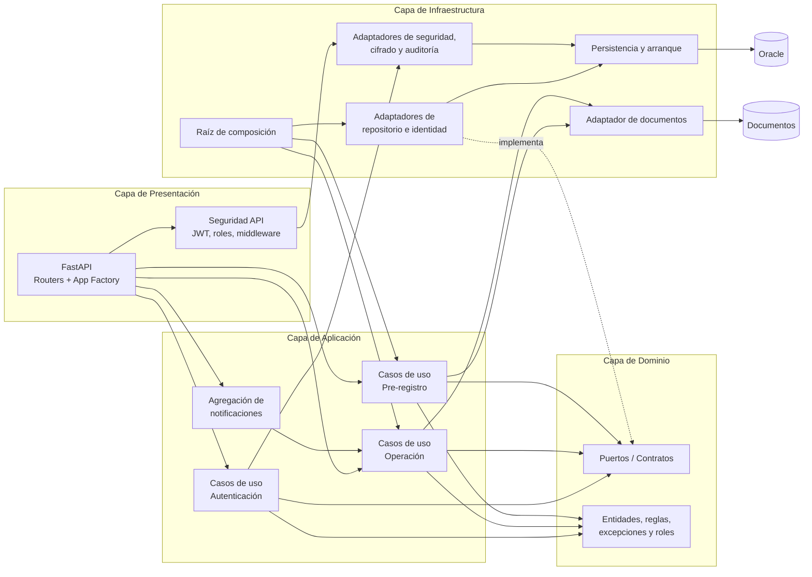

# Clean Architecture

Este diagrama resume la organización lógica del backend bajo arquitectura limpia y muestra la dirección esperada de las dependencias.

## Lectura recomendada

- La `Presentación` recibe solicitudes HTTP y las delega.
- La `Aplicación` contiene la orquestación de casos de uso.
- El `Dominio` define contratos y reglas de negocio.
- La `Infraestructura` implementa adaptadores concretos.
- Las dependencias importantes apuntan hacia el `Dominio`, no al revés.

## Regla central

La lógica de negocio no debe depender de Oracle, FastAPI ni del sistema de archivos.  
La infraestructura depende del dominio y de la aplicación, no al contrario.
