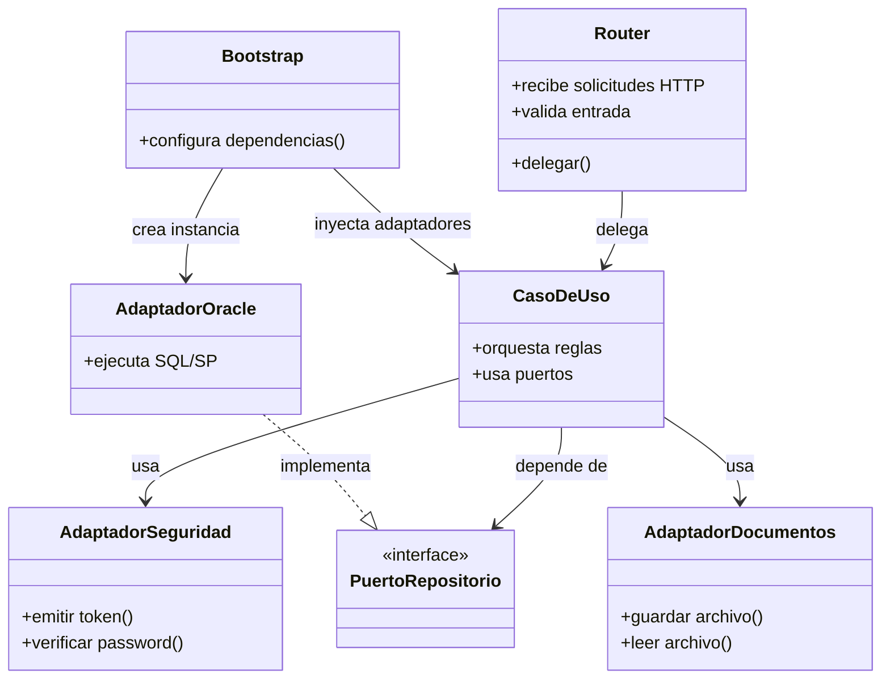

# Patrones y Decisiones de Diseño

## Diagrama de patrones principales

## Patrones identificados en el proyecto

| Patrón | Dónde aparece | Propósito |
|---|---|---|
| Clean Architecture | `presentation`, `application`, `domain`, `infrastructure` | Separar responsabilidades y controlar dependencias |
| Repository | `domain/*/ports.py` + `infrastructure/*/repository.py` | Abstraer el acceso a datos |
| Ports and Adapters | Puertos en dominio y adaptadores en infraestructura | Desacoplar negocio de tecnología |
| Dependency Injection / Composition Root | `bootstrap.py` y `dependencies.py` | Conectar implementaciones concretas sin acoplar los casos de uso |
| Adapter | seguridad, Oracle, documentos, cifrado | Adaptar APIs externas a contratos internos |
| Aggregator / Facade | `notificaciones.py` | Unificar información de varios módulos en una sola respuesta |
| Guard / Interceptor | `auth.guard.ts`, `auth.interceptor.ts` | Controlar acceso y enriquecer solicitudes en frontend |

## Decisiones de diseño sugeridas para documentar en el SDD

### Decisión 1: usar arquitectura limpia

- Motivo: separar negocio, transporte HTTP, persistencia y detalles técnicos.
- Beneficio: mayor mantenibilidad y pruebas más enfocadas.
- Costo: más archivos, más wiring y más disciplina arquitectónica.

### Decisión 2: usar puertos y repositorios

- Motivo: evitar acoplar los casos de uso directamente a Oracle.
- Beneficio: permite cambiar implementaciones sin tocar la lógica de negocio.
- Costo: más abstracción y más contratos a mantener.

### Decisión 3: centralizar autenticación y seguridad

- Motivo: mantener JWT, roles y políticas de acceso en puntos consistentes.
- Beneficio: menor duplicación y mejor control transversal.
- Costo: dependencia fuerte de convenciones compartidas entre frontend y backend.

### Decisión 4: separar documentos del almacenamiento relacional

- Motivo: los binarios viven mejor en filesystem que en tablas operativas.
- Beneficio: simplifica exportación, recuperación y manejo de archivos.
- Costo: hay que sincronizar metadatos en BD y archivos físicos.
