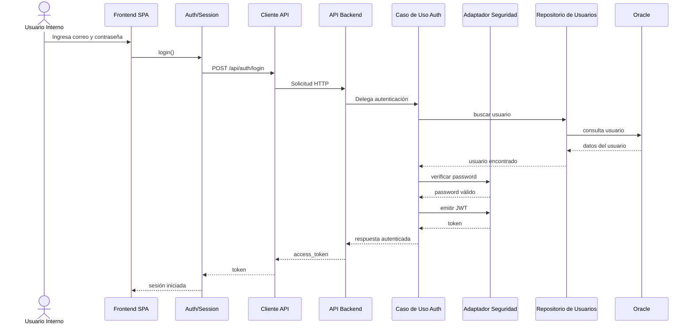
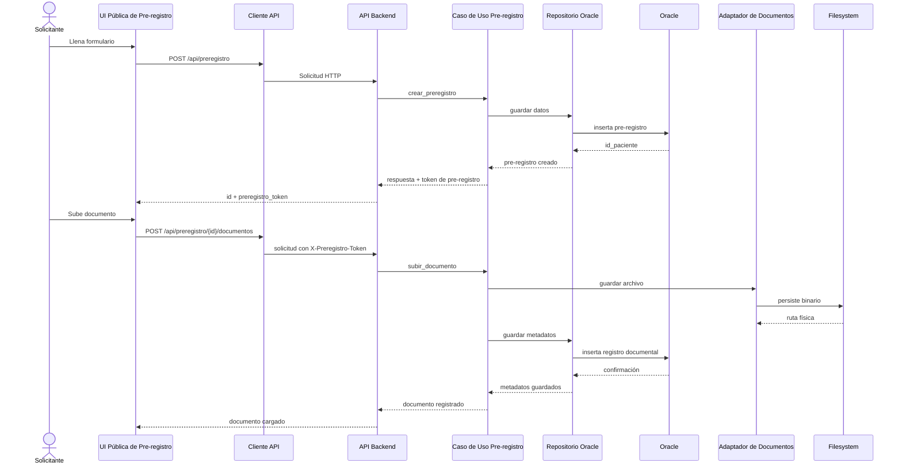

# Flujos Clave

## Flujo 1: Login de usuario interno

## Flujo 2: Pre-registro y carga de documentos

## Uso en el SDD

- Usa el flujo de `login` para justificar seguridad, sesiones y adapters.
- Usa el flujo de `pre-registro` para explicar el uso de tokens acotados, repositorios y almacenamiento documental.
- Si necesitas más detalle, el siguiente diagrama natural sería `creación de cita` o `exportación de reportes`.
